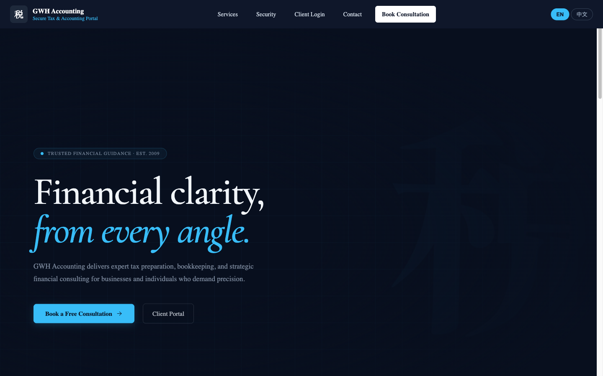
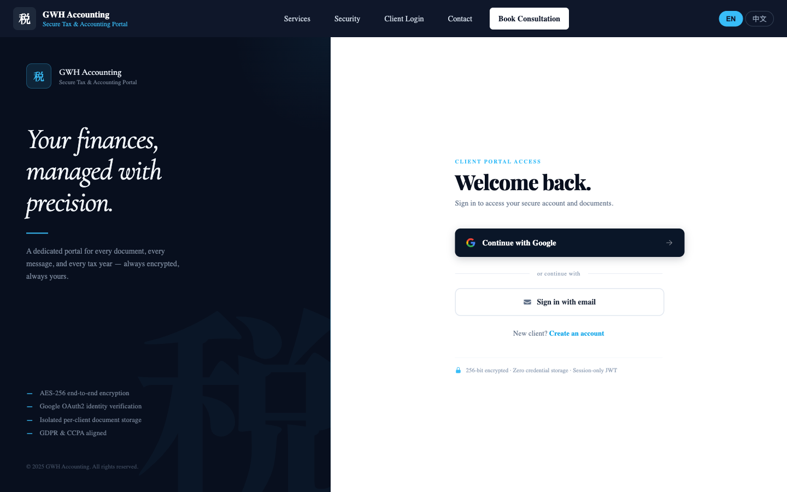
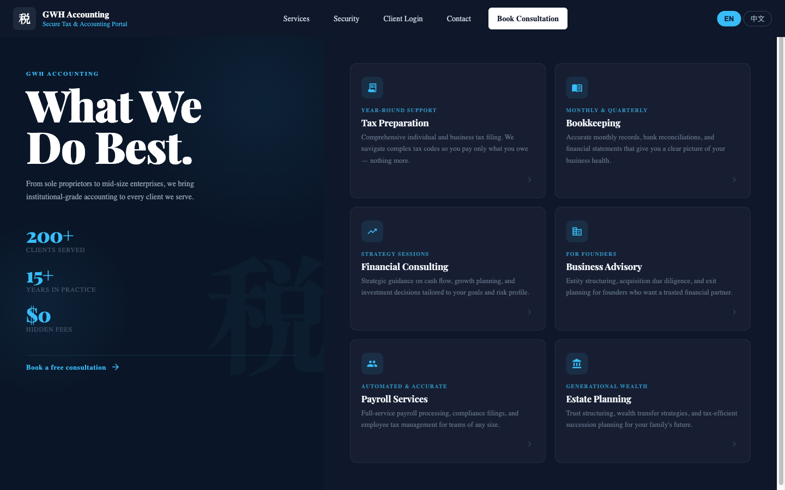
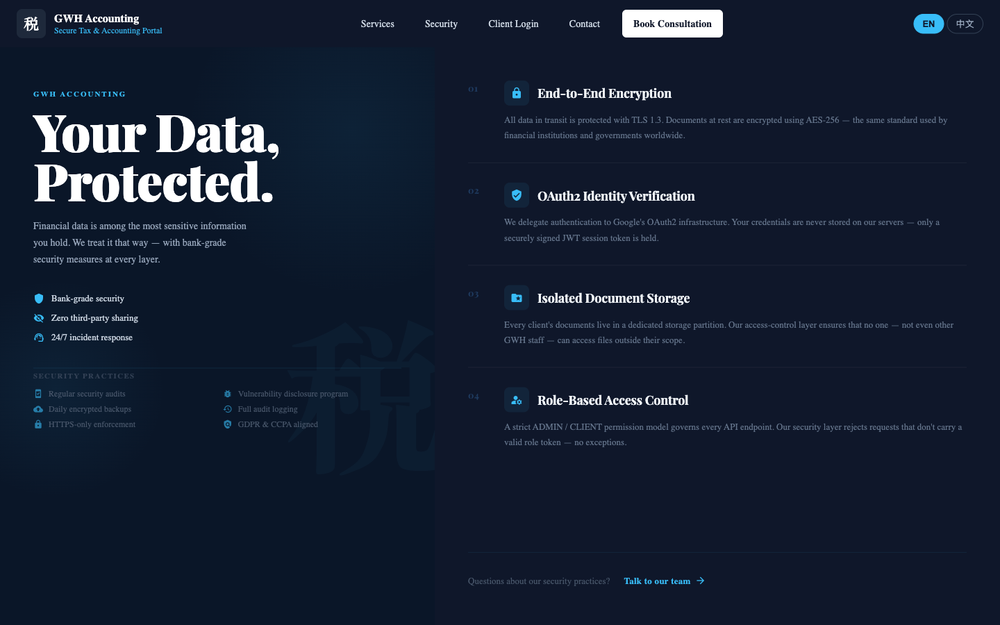
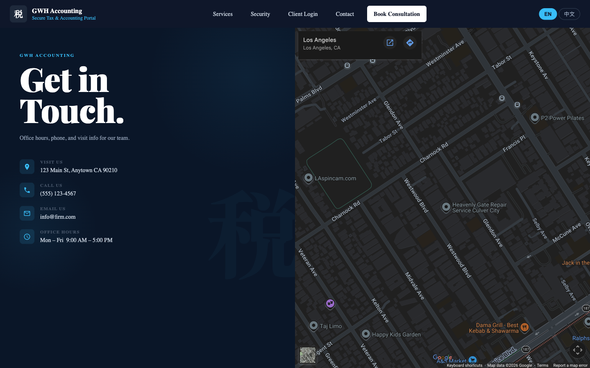
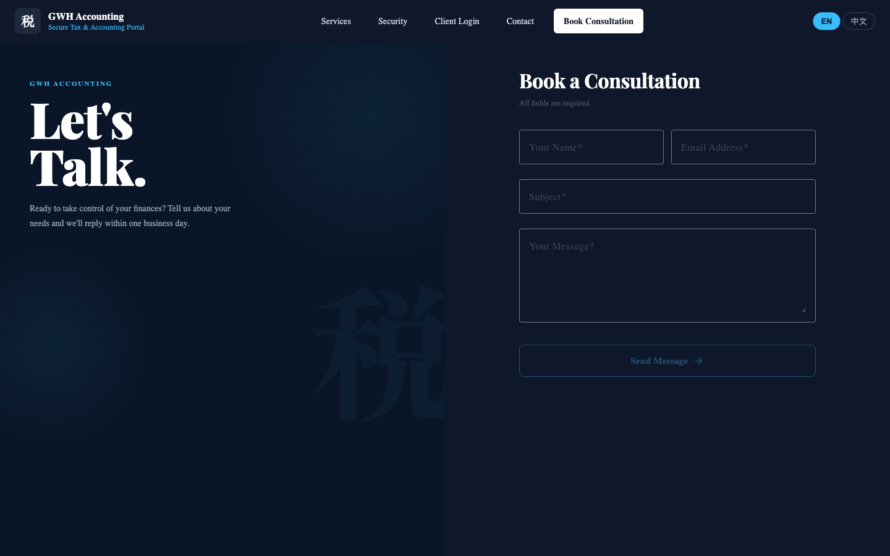

# GWH Accounting — Secure Tax & Accounting Portal

> A full-stack web application for an accounting firm: premium public marketing site, encrypted client document portal, secure messaging, and an admin management panel — all in one monorepo.



---

## What This Project Is

GWH Accounting is a production-ready web application built for a real accounting firm. It combines two distinct experiences in a single codebase:

1. **Public marketing site** — A professional dark-navy website where prospective clients learn about services, review security practices, book consultations, and get in touch.
2. **Secure client portal** — An authenticated area where existing clients upload and download tax documents, exchange messages with their accountant, and track their dashboard year-over-year.
3. **Admin panel** — A role-gated back-office used by GWH staff to manage clients, upload documents on their behalf, and conduct threaded message conversations.

Authentication is handled entirely through **Google OAuth2** — clients never create a password on this site. After sign-in, a short-lived `httpOnly` JWT cookie keeps the session secure.

---

## Tech Stack

| Layer | Technology |
|---|---|
| **Frontend** | Angular 21, standalone components, zoneless change detection |
| **UI Library** | Angular Material (dark theme) |
| **Backend** | Java 21, Spring Boot 3.5 |
| **Auth** | Google OAuth2 + Spring Security + `httpOnly` JWT cookie |
| **Database** | PostgreSQL 16 with Flyway migrations |
| **Testing** | Vitest + Angular TestBed (frontend) · JUnit 5 + Spring Boot Test (backend) · Playwright (E2E) |
| **Containerisation** | Docker + Docker Compose (dev & prod variants) |

---

## Application Architecture

```
┌─────────────────────────────────────────────────────────┐
│                    Browser (Angular 21)                  │
│                                                          │
│  Public site          Client portal       Admin panel    │
│  / /services          /portal/dashboard   /admin/clients │
│  /security /contact   /portal/documents   /admin/...     │
│  /book-consultation   /portal/messages                   │
└────────────────────────┬────────────────────────────────┘
                         │  HTTP + JWT cookie (httpOnly)
                         │  (dev: proxied via Angular dev server)
┌────────────────────────▼────────────────────────────────┐
│               Spring Boot 3.5  (port 8080)               │
│                                                          │
│  Spring Security ── Google OAuth2 ── JWT issuance        │
│  REST controllers ── Services ── Spring Data JPA         │
│  Flyway migrations  File upload/download  Email (SMTP)   │
└────────────────────────┬────────────────────────────────┘
                         │
              ┌──────────▼──────────┐
              │   PostgreSQL 16     │
              │   accounting_firm   │
              └─────────────────────┘
```

### Auth flow

```
User clicks "Continue with Google"
  → GET /oauth2/authorization/google          (Spring Security redirect)
  → Google consent screen
  → GET /login/oauth2/code/google             (OAuth2 callback)
  → Spring issues httpOnly JWT cookie
  → Redirect to /portal/dashboard  (USER role)
               /admin/clients      (ADMIN role)
```

### Role model

| Role | Access |
|---|---|
| **Unauthenticated** | Public marketing pages only |
| **USER** | `/portal/dashboard`, `/portal/documents`, `/portal/messages` |
| **ADMIN** | `/admin/clients` and all per-client sub-pages |

---

## Pages & Screenshots

### 🏠 Home

The marketing homepage — hero section with animated kanji, stats strip, services preview, client portal teaser, security badges, and a consultation CTA.


---

### 🔐 Client Login

Split-screen login: dark brand panel on the left, clean sign-in form on the right. Supports Google OAuth2 (primary), email/password, and new-account registration.



---

### 💼 Services

Six service cards — Tax Preparation, Bookkeeping, Financial Consulting, Business Advisory, Payroll Services, and Estate Planning — with animated entrance effects.



---

### 🛡️ Security

Four security pillars (AES-256 encryption, OAuth2 identity, isolated document storage, RBAC) plus a grid of security practices.



---

### ✉️ Contact & Book Consultation

Contact page with office details and an embedded map. Book Consultation page with a full inquiry form delivered by email to the firm.

<table>
<tr>
<td></td>
<td></td>
</tr>
</table>

---

### 📂 Client Portal *(requires login)*

After signing in, clients land on a **Dashboard** showing recent documents and unread messages. From there they can:

| Page | Path | What it does |
|---|---|---|
| Dashboard | `/portal/dashboard` | Recent documents, unread message count, quick-links |
| Documents | `/portal/documents` | Upload files, browse year-grouped document history, download |
| Messages | `/portal/messages` | Inbox of message threads with the accountant |
| Thread view | `/portal/messages/:id` | Full conversation thread, reply composer |

---

### 🗂️ Admin Panel *(requires ADMIN role)*

Staff access a dedicated back-office to manage all clients:

| Page | Path | What it does |
|---|---|---|
| Client list | `/admin/clients` | Paginated, filterable client roster |
| Client documents | `/admin/clients/:id/documents` | Upload/manage documents for any client, select tax year |
| Client messages | `/admin/clients/:id/messages` | View all thread threads for a client with read/awaiting/unread chip indicators |
| Thread view | `/admin/clients/:id/messages/:id` | Full thread view with reply composer |

---

## User Journeys

### New client
```
Home → Book Consultation (inquiry form → email to firm)
     → Register (/register) → Google OAuth2 → Portal Dashboard
```

### Returning client
```
Home → Client Login → Google OAuth2 → Portal Dashboard
                    → Documents (download tax return / upload W2)
                    → Messages  (read reply from accountant)
```

### Admin staff
```
Login → /admin/clients (client list)
      → Client row → Documents tab (upload signed return)
      → Client row → Messages tab → Thread (reply to client query)
```

---

## Development Setup

### Prerequisites

- Java 21
- Node.js 20+
- PostgreSQL 16 (or Docker)

### 1. PostgreSQL

**Option A — Homebrew:**
```bash
brew install postgresql@16
brew services start postgresql@16
createdb accounting_firm
```

**Option B — Docker:**
```bash
docker run -d --name accounting-pg \
  -e POSTGRES_DB=accounting_firm \
  -e POSTGRES_USER=postgres \
  -e POSTGRES_PASSWORD=postgres \
  -p 5432:5432 \
  postgres:16
```

### 2. Environment variables

Create `.env` at the project root (already gitignored):

```bash
# Google OAuth2 — console.cloud.google.com
# Authorized redirect URI: http://localhost:8080/login/oauth2/code/google
GOOGLE_CLIENT_ID=your-client-id.apps.googleusercontent.com
GOOGLE_CLIENT_SECRET=your-client-secret

# JWT signing key — at least 32 characters
JWT_SECRET=change-me-to-a-random-32-char-string

# PostgreSQL
SPRING_DATASOURCE_URL=jdbc:postgresql://localhost:5432/accounting_firm
SPRING_DATASOURCE_USERNAME=postgres
SPRING_DATASOURCE_PASSWORD=postgres

# File uploads
UPLOAD_DIR=./uploads
UPLOAD_MAX_FILE_SIZE_MB=10
UPLOAD_MAX_FILENAME_LENGTH=100
BLOCKED_EXTENSIONS=exe,js

# Contact form destination
CONTACT_NOTIFICATION_EMAIL=you@example.com
```

### 3. Start the backend
```bash
./start.sh
```
Loads `.env` automatically, activates the `dev` Spring profile, starts on `localhost:8080`.

### 4. Start the frontend
```bash
cd frontend && npm start
```
Angular dev server on `localhost:4200`. The proxy forwards `/api/**`, `/oauth2/**`, and `/login/oauth2/**` to the backend.

---

## Docker Compose (local, all-in-one)

Boots Postgres, Spring Boot, and Angular in one command — no local Java or Node required.

```bash
docker compose up --build        # build and start
docker compose up --build -d     # background mode
docker compose down              # stop (keeps DB data)
docker compose down -v           # stop + wipe DB and uploads
```

| Service | URL |
|---|---|
| Frontend | http://localhost:4200 |
| Backend | http://localhost:8080 |
| Postgres | localhost:5432 |

> **Note:** The OAuth2 callback URL stays `http://localhost:8080/login/oauth2/code/google` — register this in Google Cloud Console.

---

## Production Deployment

### 1. Create `.env.prod`

Copy `.env` and fill production values. Add SMTP for outbound email:

```bash
SPRING_MAIL_HOST=smtp.gmail.com
SPRING_MAIL_PORT=587
SPRING_MAIL_USERNAME=you@gmail.com
SPRING_MAIL_PASSWORD=your-app-password   # Google App Password (not your login password)

OAUTH2_REDIRECT_URI=https://your-domain/portal/dashboard
CORS_ALLOWED_ORIGINS=https://your-domain
POSTGRES_PASSWORD=strong-random-password
```

### 2. Publish Docker images

Push a `v*` git tag to trigger the GitHub Actions release workflow:

```bash
git tag v1.0.0 && git push origin v1.0.0
```

Required GitHub secrets: `DOCKERHUB_USERNAME`, `DOCKERHUB_TOKEN`.

### 3. Deploy on server

```bash
git clone git@github.com:gwang-indoc/accounting-firm.git && cd accounting-firm
# place .env.prod here
docker compose -f docker-compose.prod.yml pull
docker compose -f docker-compose.prod.yml up -d
```

### 4. Before going live checklist

- [ ] HTTPS terminated (Caddy / Traefik / nginx + Let's Encrypt)
- [ ] `app.cookie.secure=true` in `application-prod.yml` (JWT cookie requires HTTPS)
- [ ] Production OAuth2 callback URL registered in Google Cloud Console
- [ ] Docker Hub repositories set to **Private**
- [ ] Scheduled `pg_dump` backups configured

---

## Commands Reference

### Backend
```bash
./start.sh                                    # run (loads .env, dev profile)
cd backend && ./mvnw test                     # all tests
cd backend && ./mvnw test -Dtest=ClassName    # single class
cd backend && ./mvnw clean package -DskipTests
```

### Frontend
```bash
cd frontend && npm start                      # dev server → localhost:4200
cd frontend && npx ng test --no-watch         # all tests
cd frontend && npx ng test --include='**/foo.spec.ts'
cd frontend && npm run build                  # production build
```

### E2E (Playwright)
```bash
# Backend and frontend must be running first
cd e2e && npx playwright test                 # all tests
cd e2e && npx playwright test --grep "login"  # filter by keyword
cd e2e && npx playwright test contact.spec.ts # single file
```
