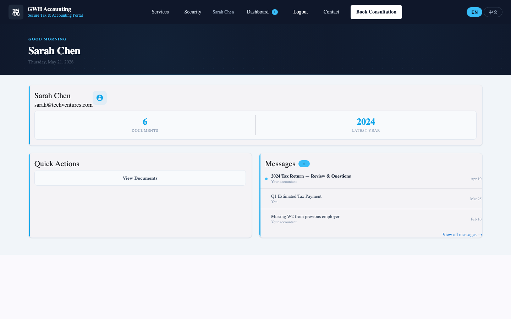
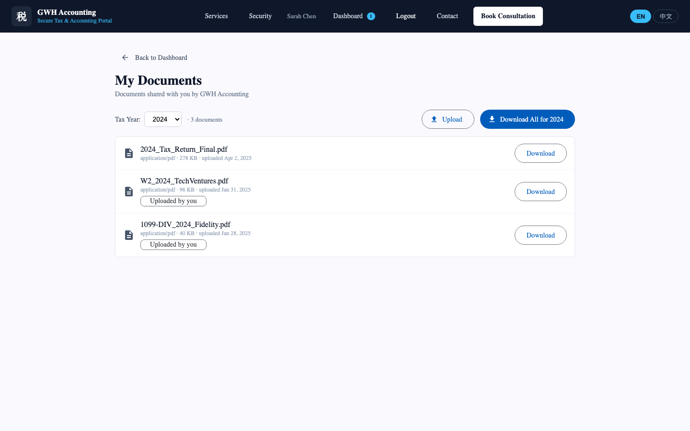
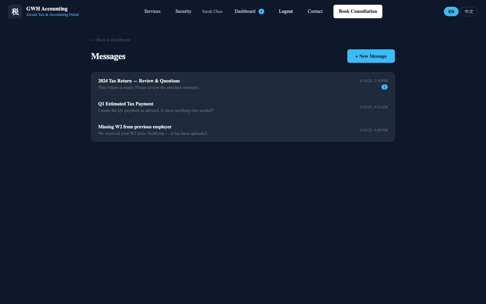
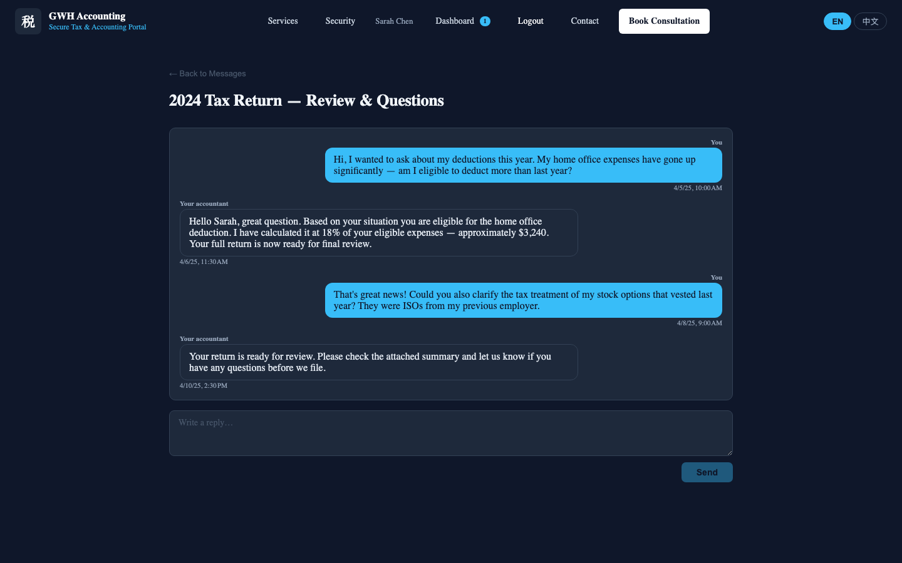
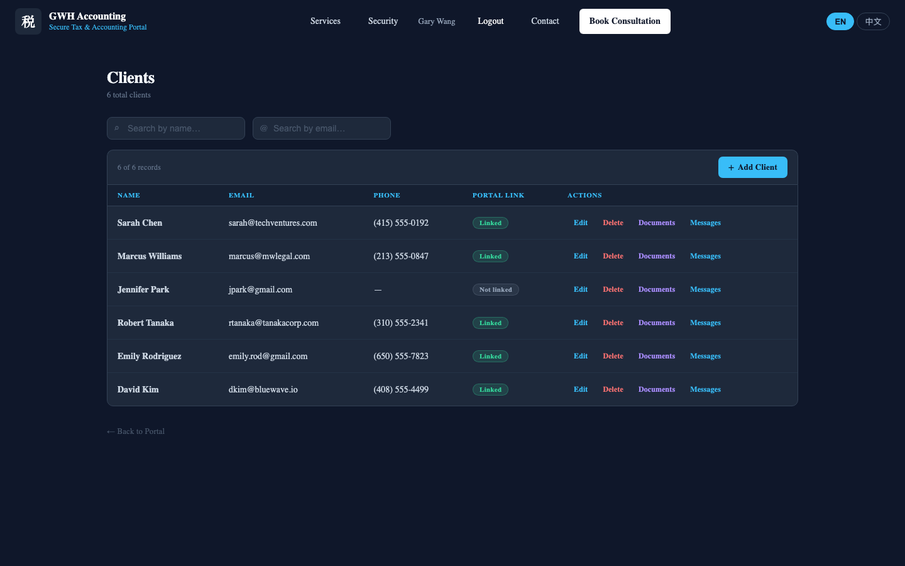
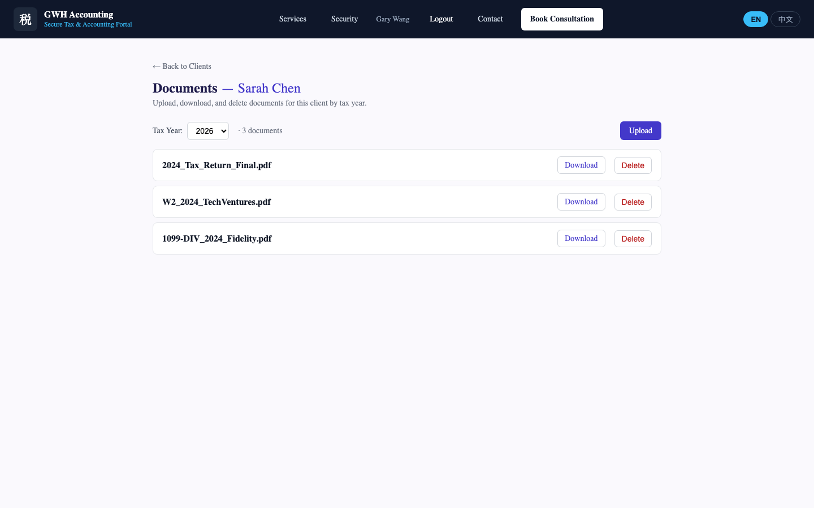
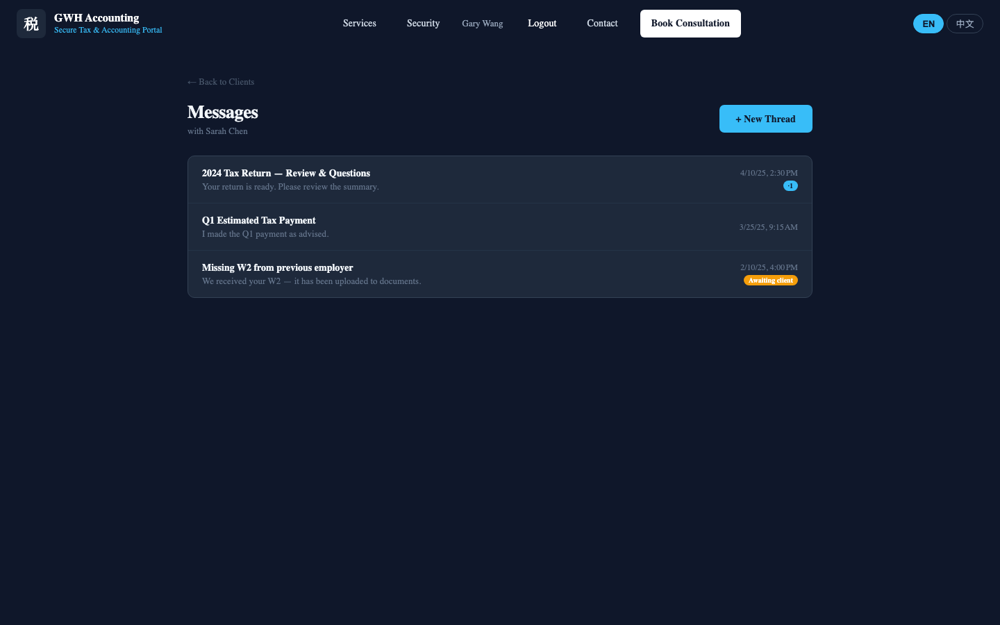

# GWH Accounting User Guide

**Welcome to the GWH Accounting Portal**

This guide helps you get the most out of our platform for managing tax documents, communicating securely with your accountant, and maintaining complete financial records.

- **For Clients:** Learn how to upload documents, download tax returns, and message your accountant
- **For Admin Staff:** Learn how to manage clients, upload documents on their behalf, and support client inquiries

---

## Table of Contents

### Part 1: Quick Start
- Quick Start for Clients
- Quick Start for Admin Staff

### Part 2: Public Site
- Home & Navigation
- Services Overview
- Security & Trust
- Contact & Book Consultation

### Part 3: Client Portal
- Getting Started
- Dashboard Overview
- Document Management
- Secure Messaging

### Part 4: Admin Panel
- Getting Started
- Client Management
- Per-Client Document Management
- Per-Client Messaging & Support

### Part 5: Reference
- Frequently Asked Questions
- Troubleshooting
- Security & Privacy

---

# Part 1: Quick Start

## Quick Start for Clients

Welcome! The GWH Accounting portal is your secure hub for managing tax documents and communicating with your accountant. You'll spend most of your time in three main areas: uploading documents, downloading tax returns, and messaging your accountant.

### What You Can Do

- **Upload tax documents** — Submit W2s, 1099s, receipts, and other supporting files for your tax preparation
- **Download tax returns** — Access completed tax returns, financial reports, and other documents prepared by our team
- **Send secure messages** — Communicate confidentially with your accountant about your account or questions
- **View your account dashboard** — See document counts, your latest tax year, and recent message threads at a glance

### Your First Login (5 minutes)

1. Go to https://gwh-accounting.com
2. Click **"Client Login"** in the navigation bar
3. Click the blue **"Continue with Google"** button
4. Sign in with the Google account associated with your email
5. You'll be taken to your **Dashboard** — your personalized welcome screen

That's it! You're in the portal.

### Your First Tasks

**Task 1: Upload a Document (2 minutes)**
1. From your Dashboard, click **"Documents"** in the left sidebar
2. Click the **"Upload Document"** button
3. Select a file from your computer (W2, 1099, receipt, etc.)
4. Choose the **tax year** from the dropdown
5. Click **"Upload"**
6. The document appears in your portal — your accountant can see it immediately

**Task 2: Check for Messages (1 minute)**
1. Click **"Messages"** in the left sidebar
2. Look for any threads with a **blue unread badge**
3. Click a thread to read the full conversation
4. Type your reply in the message composer at the bottom
5. Click **"Send"**

**Task 3: Download a Tax Return (1 minute)**
1. Go to **Documents**
2. Find the document you want (it's labeled "Tax Return" or "Financial Report")
3. Click it and select **"Download"**
4. The file saves to your computer's Downloads folder

### Key Features at a Glance

| Feature | What It Does | Where to Find It |
|---------|-------------|-----------------|
| **Dashboard** | Shows your document count, latest tax year, recent messages | Home screen after login |
| **Documents** | Upload files, download tax returns | Left sidebar → "Documents" |
| **Messages** | Send secure messages to your accountant | Left sidebar → "Messages" |
| **Security** | Your data is encrypted; only you and your accountant can see it | Learn more in "Security & Privacy" |

### Tips for Success

- **Set a reminder** to upload documents before tax time — the sooner the better for us to prepare your return
- **Check messages weekly** — we may ask for clarification on documents you submitted
- **Keep file sizes under 10 MB** — use mobile camera apps to scan receipts if needed
- **Don't use special characters** in filenames — stick to letters, numbers, dashes, and underscores

### Need Help?

- See the full **"Troubleshooting"** section if you run into problems
- Check **"Frequently Asked Questions"** for common issues
- Or just message your accountant directly — we're happy to help

---

## Quick Start for Admin Staff

Welcome to the GWH Accounting admin panel. This is your back-office for managing clients, uploading documents on their behalf, and handling client inquiries through secure messaging.

### What You Can Do

- **Manage clients** — Add, edit, and search your client roster with portal access control
- **Upload documents** — Submit tax returns, financial reports, and other documents directly to any client's account
- **Organize by tax year** — Manage documents across multiple filing years for the same client
- **Reply to client messages** — Respond to inquiries, track conversation status, prioritize unread threads
- **Create new message threads** — Start conversations with clients about their accounts

### Your First Login (2 minutes)

1. Go to https://gwh-accounting.com
2. Click **"Client Login"** (staff use the same entry point)
3. Click the blue **"Continue with Google"** button
4. Sign in with your GWH staff Google account
5. You'll be redirected to the **Admin Panel** — your client roster

That's it! You now see all clients and their data.

### Your First Tasks

**Task 1: Find a Client (1 minute)**
1. You're on the **Client Management** page (the main admin dashboard)
2. Use the search box to find a client by name or email
3. Click the client's row to expand their options
4. You see **"Documents"** and **"Messages"** tabs — click either to manage that client's data

**Task 2: Upload a Document for a Client (3 minutes)**
1. Find a client and click their row
2. Click the **"Documents"** tab
3. Use the **year selector** at the top to choose the tax year (e.g., 2025, 2024)
4. Click **"Upload Document"**
5. Select a file from your computer
6. Click **"Upload"**
7. The document appears in the client's portal immediately — they can download it

**Task 3: Reply to a Client Message (2 minutes)**
1. Find a client and click their row
2. Click the **"Messages"** tab
3. You see all message threads for this client
4. Notice the **status chips** — sky-blue means unread, amber means awaiting client reply, grey means client read
5. Click a thread to open the full conversation
6. Type your reply in the composer at the bottom
7. Click **"Send"**

**Task 4: Create a New Client (2 minutes)**
1. From the main Client Management page, click **"Create Client"**
2. Fill in the form: name, email, phone (if available)
3. Click **"Save"**
4. The new client appears in your roster — they can now log in and use the portal

### Key Features at a Glance

| Feature | What It Does | Where to Find It |
|---------|-------------|-----------------|
| **Client List** | Search and manage all clients | Main admin dashboard |
| **Documents Tab** | Upload/download/delete docs for any client | Click client row → "Documents" |
| **Messages Tab** | View and reply to client threads | Click client row → "Messages" |
| **Status Chips** | See at a glance if client has replied or opened your message | Messages tab; color-coded |
| **Year Selector** | Organize documents across multiple tax years | Documents tab → dropdown |

### Admin Status Indicators (Color-Coded Messages)

- **Sky-blue badge** — "Client replied" (unread) — Check this first; client is waiting for response
- **Amber "Awaiting client"** — You sent a message; client hasn't opened it yet
- **Grey "Client read"** — Client has read your message; acknowledged

Use these to prioritize your message queue.

### Tips for Success

- **Use the search box** — Fastest way to find a client when you have dozens
- **Check year selector** — Easy to miss which year you're viewing; always double-check before uploading
- **Organize by year** — Upload 2025 docs to 2025, 2024 docs to 2024, etc. — clients will thank you
- **Message often** — Stay in regular contact; clients appreciate quick responses
- **Document everything** — If you make a change (delete, edit), note it in a message to the client

### Common Workflows

**Receiving a client's tax documents:**
1. Client uploads W2, 1099s, receipts
2. You review them
3. You message: "Received your 2025 documents. I'll have your return ready by [date]."

**Delivering a completed tax return:**
1. You upload the signed PDF to the client's 2025 Documents folder
2. You message: "Your 2025 tax return is ready in your Documents tab. Please review and let me know if you have questions."
3. Client downloads and reviews
4. If questions, they reply via Messages

**Handling a client question:**
1. Client sends message: "Can I deduct home office expenses?"
2. You see sky-blue unread badge on their thread
3. You reply with guidance or ask clarifying questions
4. Status updates as client reads/replies

### Need Help?

- See the full **"Troubleshooting"** section if you run into problems
- Check **"Frequently Asked Questions"** for common issues
- Reach out to your manager with feature requests or bugs

---

# Part 2: Public Site Features

## Home & Navigation

The home page is your first impression of GWH Accounting. It introduces the firm, highlights key services, and invites you to sign in or book a consultation.

*Figure 1: Home page hero section with brand introduction and calls-to-action*

### What You See

- **Hero section** — The animated GWH logo and introduction: "Secure Tax & Accounting Portal"
- **Stats strip** — Key numbers about the firm (years in business, clients served, documents secured)
- **Services preview** — Clickable cards for the six main services
- **Client portal teaser** — A preview of what clients can do after signing in
- **Security badges** — Visual indicators that the platform is secure and trusted
- **"Book Consultation" button** — Large CTA to schedule an initial meeting

### How to Navigate

From the home page, you can:
- Click **"Services"** to learn about the six offerings in detail
- Click **"Security"** to understand how your data is protected
- Click **"Contact"** for office information, phone, and directions
- Click **"Book Consultation"** to schedule a meeting
- Click **"Client Login"** if you already have an account

---

## Services Overview

The services page showcases the six core offerings: Tax Preparation, Bookkeeping, Financial Consulting, Business Advisory, Payroll Services, and Estate Planning. Each service card explains what it covers and invites you to book a consultation.

*Figure 2: Services overview showing tax preparation, bookkeeping, consulting, advisory, payroll, and estate planning*

### What It Is

Each service card displays:
- **Service name** — Tax Preparation, Bookkeeping, etc.
- **Description** — What the service covers and who it's for
- **Key benefits** — What you gain from this service
- **Call-to-action** — A link to book this specific service or learn more

### How to Use It

1. Browse the services to find which one matches your needs
2. Click a card to expand details (if applicable)
3. Click **"Book Consultation"** to schedule a call with someone who can discuss this service
4. We'll contact you within 24 hours to confirm your preferred time

---

## Security & Trust

GWH Accounting takes data security seriously. This section explains the technical and operational measures that protect your information.

*Figure 3: Security features highlighting encryption, identity verification, data isolation, and access control*

### What It Is

The security section covers:
- **Data encryption** — All documents encrypted with AES-256 at rest, TLS in transit
- **Authentication** — Google OAuth2 prevents password breaches; you never create a password on this site
- **Isolated storage** — Your data is stored separately from other clients; no cross-access
- **Role-based access** — Only your accountant (and you) can see your documents

### How to Use It

- **To understand our practices:** Read each security pillar
- **To report a vulnerability:** Contact security@gwh-accounting.com
- **To ask questions:** Reach out to your accountant or the firm directly

### Why It Matters

You're trusting us with sensitive financial data. Our security practices ensure:
- Your documents stay private
- Your communications are encrypted
- Even if a hacker breaches our servers, they can't read your data without the encryption keys
- Your accountant has access; no one else does

---

## Contact & Book Consultation

Two pages help you get in touch and schedule your first meeting.

### Contact Page

*Figure 4: Contact information page with office location, phone number, email, and interactive map*

**What You See:**
- Office address and directions
- Phone number for voice calls
- Email address for inquiries
- Embedded map showing our location
- Office hours

**How to Use It:**
- Call or email with general questions
- Use the map to plan your visit (yes, we offer in-person meetings)
- Send a message if you prefer email communication

### Book Consultation Page

*Figure 5: Book consultation form for scheduling an initial meeting*

**What You See:**
- **Name** — Your full name
- **Email** — Your contact email
- **Phone** — Your phone number (optional but helpful)
- **Preferred Service** — Dropdown to select which service you're interested in
- **Message** — Space to explain your situation or ask questions
- **Submit button** — Send your inquiry

**How to Use It:**
1. Fill in your name and email
2. Select the service you're interested in (e.g., Tax Preparation)
3. Optionally add your phone number
4. Type a brief message (e.g., "I'm a freelancer looking for bookkeeping help")
5. Click **"Submit"**
6. Your inquiry is delivered to the firm by email
7. Someone will contact you within 24 hours to schedule

**What Happens Next:**
- We review your inquiry
- We call or email to discuss your needs
- We schedule a time that works for you
- In your first call, we learn about your situation and explain how we can help

---

# Part 3: Client Portal

Once you sign in with your Google account, you enter the client portal — your personalized workspace for documents, messages, and account overview.

## Getting Started

### Your Login Flow

1. **Visit the site** — Go to https://gwh-accounting.com
2. **Click "Client Login"** — Top navigation or home page CTA
3. **See the login screen** — (Screenshot below)

*Figure 6: Client login page with Google OAuth2 button*

4. **Click "Continue with Google"** — The blue button (primary sign-in method)
5. **Authenticate** — Google prompts you to sign in if you're not already; you may see a "Grant Access" screen
6. **Redirected to dashboard** — You're now logged in and see your personalized dashboard
7. **Look for unread badges** — Messages tab may show a blue badge if your accountant sent you something

### Account Security

- **No password to create** — Google OAuth2 handles authentication; much more secure
- **httpOnly JWT cookie** — Your session is managed by a secure token that can't be stolen by browser scripts
- **Logout anytime** — Click your profile in the top-right → "Logout"; you're immediately signed out
- **Forgotten password?** — No password to forget! Just click "Continue with Google" again

---

## Dashboard Overview

The dashboard is your home screen — a snapshot of your account, recent activity, and quick navigation.

*Figure 7: Client portal dashboard with stats, quick navigation, and recent message list*

### What You See

- **Welcome header** — "Welcome, [Your Name]"
- **Document stats** — Total documents uploaded, count by year
- **Latest tax year** — The most recent year on file
- **Quick navigation** — Buttons to jump to Documents or Messages
- **Recent message threads** — The 3 most recent threads with previews
- **Unread badges** — Blue badges on threads if your accountant has replied

### How to Use It

- **Check stats** — See at a glance how many documents you've uploaded
- **Jump to Documents** — Click the Documents button to upload a new file
- **Check for replies** — Scan the message list for unread badges (blue)
- **Click a thread** — Jump directly to a recent conversation
- **Refresh** — Reload the page to see new activity

### Pro Tips

- **Set a weekly reminder** — Check your dashboard every Sunday to catch any messages from your accountant
- **Don't wait until tax season** — Upload documents as they arrive (W2, 1099, receipts) rather than batching them in March
- **Look for blue badges** — Unread messages need attention; respond quickly to keep things moving

---

## Document Management

The Documents page is where you upload tax documents and download completed returns from your accountant.

*Figure 8: Client document management showing upload interface and tax-year filtered document list*

### What You See

- **Upload button** — "Upload Document" (blue button)
- **Year selector** — Dropdown to filter documents by tax year (2026, 2025, 2024, etc.)
- **Document table** — List of uploaded files with:
  - Filename
  - Upload date
  - File size
  - Download link

### How to Upload a Document

1. Click **"Upload Document"** (blue button at top)
2. Click **"Select File"** or drag a file into the upload area
3. Choose a file from your computer (W2, 1099, receipt, tax return, etc.)
4. Choose the **tax year** from the dropdown (e.g., "2025")
5. Click **"Upload"**
6. Wait for confirmation: "Document uploaded successfully"
7. The file appears in your document list immediately

### Supported File Types

- **PDF** (.pdf)
- **Microsoft Office** (.docx, .xlsx, .xls)
- **Images** (.jpg, .png) — useful for scanned receipts or photos
- **Max size:** 10 MB per file

### How to Download a Document

1. Find the document in the table (use the year selector to filter if needed)
2. Click **"Download"** on the right side of the row
3. The file saves to your computer's Downloads folder
4. Open it with your default app (Adobe Reader for PDFs, Excel for spreadsheets, etc.)

### Common Documents You'll See

**Documents you upload:**
- W2 forms (from your employer)
- 1099 forms (from clients if you're self-employed)
- Receipts and invoices
- Bank statements
- Mortgage/loan statements

**Documents your accountant uploads:**
- Tax returns (signed and ready to file)
- Financial reports or balance sheets
- IRS correspondence
- Amended returns or extensions

### Pro Tips

- **Organize early** — Don't wait until tax season to upload; send documents as they arrive
- **Use the year selector** — Manage multiple years if you work with the firm for several years
- **Keep scans readable** — If photographing receipts, make sure the text is legible
- **Ask questions** — If you're unsure what to upload, message your accountant first

---

## Secure Messaging

The Messages section is your private inbox for communicating with your accountant. All messages are encrypted.

### Inbox View

*Figure 9: Client message inbox with threaded conversations and unread indicators*

**What You See:**
- **New Message button** — "New Message" button to start a conversation
- **Thread list** — All your conversations with your accountant
- **Thread preview** — First few words of the latest message in each thread
- **Unread badge** — Blue badge if your accountant has replied and you haven't read it yet
- **Timestamp** — When the most recent message was sent

**How to Use the Inbox:**
1. Scan the list for **blue unread badges** — these need your attention
2. Click a thread to open and read the full conversation
3. Click **"New Message"** to start a brand-new conversation (not a reply)

### Thread View (Full Conversation)

*Figure 10: Message thread detail view with conversation history and reply composer*

**What You See:**
- **Message bubbles** — Alternating colors for you (client) and your accountant
- **Timestamps** — When each message was sent
- **Message content** — The full text of each message
- **Reply composer** — Text field at the bottom to type your reply
- **Send button** — Button to send your reply

**How to Reply:**
1. Read the conversation history
2. Click in the **text field** at the bottom
3. Type your response (e.g., "Thanks for the update. Here's what I found in my receipts...")
4. Click **"Send"**
5. Your message appears immediately; your accountant gets a notification

**How to Start a New Thread:**
1. From the inbox, click **"New Message"**
2. Or from the dashboard, click a recent thread and scroll down to see the old conversation, then reply
3. A new thread keeps conversations organized by topic

### Security & Privacy

- **Encrypted in transit** — Messages are protected by TLS (like a bank)
- **Encrypted at rest** — Even if someone hacked our servers, they couldn't read your messages
- **Only you and your accountant** — No one else can see this thread
- **Permanent record** — All messages are stored indefinitely for your records

### Pro Tips

- **Be specific** — Instead of "What about the car?" write "Can I deduct vehicle mileage for business travel?"
- **Attach files** — If you need to share something, upload it to Documents and mention it in your message
- **Ask follow-up questions** — Don't hesitate to clarify if an answer isn't clear
- **Check weekly** — Messages may be time-sensitive; check at least once a week for replies

---

# Part 4: Admin Panel

The admin panel is a back-office tool for GWH staff to manage clients, upload documents on their behalf, and respond to client inquiries.

## Getting Started

### Your Login Flow (Same as Clients)

1. **Visit the site** — Go to https://gwh-accounting.com
2. **Click "Client Login"** — Top navigation or home page CTA
3. **Sign in with your GWH Google account** — Same OAuth2 flow as clients
4. **Redirected to admin dashboard** — If your account has ADMIN role, you see the client roster instead of the client portal
5. **See the client list** — All clients and their management options

### Role-Based Access

- **USER role** — Clients see the client portal (documents, messages, dashboard)
- **ADMIN role** — Staff see the admin panel (client list, bulk operations)
- **How you got ADMIN** — Your accountant or manager set this up when you were hired

---

## Client Management

The Client Management page is your main dashboard — a searchable, sortable roster of all clients.

*Figure 11: Admin client management roster with search, pagination, and per-client actions*

### What You See

- **Search box** — "Search by name or email"
- **Client table** — Rows of clients with:
  - Client name
  - Email address
  - Portal link status ("Linked" = they can log in, "Not linked" = they're on the roster but have no account yet)
  - **Documents** action button
  - **Messages** action button
- **Create Client button** — "Create Client" to add a new client to the roster
- **Pagination** — "Previous / Next" if you have many clients

### How to Use It

**Finding a client by search:**
1. Click the search box
2. Type the client's name or email (e.g., "Jane Smith" or "jane@example.com")
3. The list filters in real-time
4. Click the client's row or click "Documents" / "Messages"

**Finding a client by scrolling:**
1. Scan the table if you have only a few clients
2. Use "Previous / Next" at the bottom if there are many

**Creating a new client:**
1. Click **"Create Client"** (blue button)
2. Fill in the form:
   - **Name** — Full name (e.g., "Jane Smith")
   - **Email** — Their email (e.g., "jane@example.com")
   - **Phone** (optional) — Their phone number
3. Click **"Save"**
4. The client appears in your roster
5. They can now sign in with their Google account (if it matches their email)

**Editing or deleting a client:**
1. Find the client in the roster
2. Click **inline edit** (pencil icon) to modify their name, email, or phone
3. Click **delete** (trash icon) to remove them from the roster
4. Confirm the action

### Pro Tips

- **Use the search box** — Fastest way to find a client when you have dozens
- **Keep emails current** — Client emails must match their Google account to sign in
- **Create before portal** — Add the client to the roster first; they can sign in immediately after

---

## Per-Client Document Management

For each client, you can upload, download, and organize documents by tax year.

*Figure 12: Per-client document management interface with tax-year selector and upload interface*

### How to Access

1. From the client roster, find the client
2. Click the **"Documents"** action button on their row
3. You see their document page (similar to what the client sees, but you can upload on their behalf)

### What You See

- **Client name header** — Shows which client's documents you're managing
- **Year selector** — Dropdown to filter documents (2026, 2025, 2024, etc.)
- **Upload button** — "Upload Document"
- **Document table** — List of documents for the selected year with:
  - Filename
  - Upload date
  - Uploader (you or the client)
  - File size
  - Download button
  - Delete button

### How to Use It

**Uploading a document:**
1. Select the **tax year** from the dropdown (e.g., "2025")
2. Click **"Upload Document"**
3. Select a file from your computer
4. Click **"Upload"**
5. Confirmation: "Document uploaded successfully"
6. The document appears in the client's portal immediately under their "Documents" tab for that year
7. The client sees it labeled with your name (showing that the firm uploaded it)

**Example workflow: Uploading a completed tax return**
1. You have the signed PDF: `Jane_Smith_2025_Tax_Return.pdf`
2. Find Jane Smith in the client roster
3. Click "Documents"
4. Use year selector to choose "2025"
5. Click "Upload Document"
6. Select the PDF
7. Click "Upload"
8. Jane sees the file in her Documents tab immediately
9. She can download it and file it with the IRS

### Pro Tips

- **Check the year selector** — Easy to upload to the wrong year if you're not careful
- **Name files clearly** — Use names like `2025_Tax_Return.pdf` not `FINAL_FINAL_v2.pdf`
- **Organize by year** — Keep 2024 docs in 2024, 2025 docs in 2025, etc.
- **Download before sending** — Test that you can download the file before telling the client it's ready

---

## Per-Client Messaging & Support

For each client, you can view all message threads and reply to their inquiries.

*Figure 13: Per-client messaging interface with color-coded status indicators (unread, awaiting, read)*

### How to Access

1. From the client roster, find the client
2. Click the **"Messages"** action button on their row
3. You see their message thread list

### What You See

- **Client name header** — Shows which client's messages you're managing
- **New Message button** — "New Message" to start a conversation
- **Thread list** — All conversations with this client with:
  - Thread title / preview
  - Latest message timestamp
  - Status chip (color-coded indicator)
  - Unread badge (if applicable)

### Status Indicators (Color-Coded)

These chips show at a glance what action is needed:

- **Sky-blue badge "Unread"** — Client has replied; you haven't read it yet
  - Action: Click the thread and read the message
  - Priority: High — client is waiting for you
- **Amber chip "Awaiting client"** — You sent a message; client hasn't opened it yet
  - Action: You can reply with another message or wait for their response
  - Priority: Medium — client has the info but may not have seen it
- **Grey chip "Client read"** — Client has read your message
  - Action: If you're waiting for their response, check back later
  - Priority: Low — client has acknowledged your message

### How to Use It

**Replying to a message:**
1. Click a thread from the list
2. Read the conversation history
3. See the status of your last message (is the client reading? have they replied?)
4. Click in the **reply composer** at the bottom
5. Type your response (e.g., "Great! I found those receipts. I'll update the return and have it ready for you by Friday.")
6. Click **"Send"**
7. Your message appears immediately; the client sees a notification

**Starting a new message thread:**
1. From the client's message list, click **"New Message"**
2. Type the conversation title (e.g., "2025 Tax Return Ready for Review")
3. Type the message content
4. Click **"Send"**
5. A new thread appears in the conversation list
6. The client sees the notification and can reply

### Typical Workflows

**Workflow 1: Client Asks a Question**
1. You see a sky-blue unread badge on their thread
2. You click and read: "Can I deduct home office expenses?"
3. You reply: "Yes, you can deduct a percentage of your home expenses proportional to your office square footage. I'll calculate it for you — send me the details of your home (square footage, office area, mortgage/rent, utilities)."
4. You send the message
5. Status changes to amber "Awaiting client"
6. Client reads and replies with the details
7. Status changes back to sky-blue "Unread"
8. You see the information and incorporate it into their return

**Workflow 2: You're Ready to Deliver a Tax Return**
1. You've completed Jane's 2025 return
2. You upload it to her Documents tab (see "Per-Client Document Management")
3. You go to Messages
4. You click "New Message"
5. Title: "2025 Tax Return Ready for Review"
6. Message: "Hi Jane, your 2025 tax return is ready. Please review it in your Documents tab under 2025. Let me know if you have any questions or if I need to make any changes."
7. You send
8. Status is amber "Awaiting client"
9. Jane downloads and reviews
10. She replies with "Looks great!" or asks clarifying questions
11. Status changes back to sky-blue "Unread"
12. You confirm everything is correct or make adjustments

### Pro Tips

- **Respond promptly** — Clients appreciate quick replies (within 24 hours is great)
- **Use color chips to prioritize** — Sky-blue chips need immediate attention; grey chips can wait
- **Reference the documents** — When delivering files, tell clients exactly where to find them ("Check your Documents tab under 2025")
- **Document everything** — If you make changes to a client's return, mention it in a message so there's a record
- **Be conversational** — Messages are about building trust; be friendly and clear

---

# Part 5: Reference

## Frequently Asked Questions

### For Clients

**Q: Can I use the platform on my phone?**
A: Yes! The platform is responsive and works on phones, tablets, and desktops. All features are available on mobile.

**Q: What happens if I forget my password?**
A: You don't have a password! You sign in with Google. If you forget your Google password, reset it at myaccount.google.com.

**Q: What file formats can I upload?**
A: You can upload PDF, DOCX, XLSX, XLS, JPG, and PNG files. Maximum file size is 10 MB per document. If you have a larger file, compress it or contact your accountant.

**Q: How long do you keep my documents?**
A: We keep all documents indefinitely. They're securely stored and encrypted. You can download them anytime.

**Q: Can I export all my documents at once?**
A: Not yet, but it's on our roadmap. For now, download them individually or ask your accountant for a batch export.

**Q: How secure are my messages?**
A: Your messages are encrypted in transit (TLS) and at rest (AES-256). Only you and your accountant can see them. No one else has access.

**Q: What if I need to upload a scanned receipt?**
A: Use your phone's camera app to photograph the receipt, then upload the image (JPG or PNG). Make sure the text is legible. Keep the original for your records.

**Q: Can I share my portal with a business partner or family member?**
A: Not directly. Your login is personal. If you want to share access, reach out to your accountant — they can create a separate login for the other person.

### For Admin Staff

**Q: Can I delete a client's document permanently?**
A: Yes, click the delete button on the document. Once deleted, it's gone from both the client's view and our system. Use caution!

**Q: What if a client uploads a file with a virus?**
A: Our system scans uploads for malware. If something is detected, you'll see a warning. You can quarantine or delete suspicious files.

**Q: Can I upload on behalf of multiple clients at once?**
A: Not in bulk. You upload to one client at a time through their Documents tab. If you need a batch operation, contact your manager about tools.

**Q: What does "Linked" mean in the client roster?**
A: "Linked" means the client has a Google account that matches their email on file. They can sign in and use the portal. "Not linked" means they're on the roster but haven't signed in yet.

**Q: Can I see all clients' messages in one view?**
A: No. You view one client's messages at a time. This keeps conversations private and prevents mixing up client data.

**Q: How do I know if a client has read my message?**
A: Check the status chip on the thread. Grey "Client read" means they've opened it. The timestamp tells you when.

**Q: Can I schedule messages to send later?**
A: No, messages send immediately. Draft important messages in a text editor first, then paste them.

---

## Troubleshooting

### Login Issues

**Problem: "I can't sign in with Google"**

1. Check that you're clicking **"Continue with Google"** (not email/password)
2. Ensure your Google account email matches the email on file with the firm
3. Clear your browser cookies: Settings → Privacy → Clear browsing data
4. Try signing in in an incognito/private window
5. If still stuck, ask your accountant for help

**Problem: "I'm redirected to the wrong place after sign-in"**

1. Logout completely (click profile → Logout)
2. Clear browser cache (Ctrl+Shift+Delete or Cmd+Shift+Delete)
3. Sign in again
4. Expected: Clients go to Dashboard; staff go to Client Management

**Problem: "The sign-in button doesn't work"**

1. Check your internet connection
2. Disable browser extensions (ad blockers, password managers) temporarily
3. Try a different browser
4. Check that the site is https://gwh-accounting.com (secure connection required)

### Document Upload Issues

**Problem: "My file won't upload"**

1. Check file size — max is 10 MB
2. Verify the file format is supported (PDF, DOCX, XLSX, XLS, JPG, PNG)
3. Confirm you selected a tax year from the dropdown
4. Check your internet connection (uploads can fail on slow networks)
5. Try a smaller file first to test

**Problem: "Upload was successful, but I can't see the file"**

1. Refresh the page (Cmd+R or Ctrl+R)
2. Check the year selector — you may be viewing the wrong tax year
3. Wait 5 seconds and refresh again (sometimes there's a slight delay)
4. Ask your accountant if the file appeared on their end

**Problem: "I'm trying to upload a large file and it keeps failing"**

1. Compress the file (if PDF, use Preview on macOS or Adobe Reader on Windows)
2. Split large documents into multiple files (e.g., "2025 Receipts - Part 1.pdf", "Part 2.pdf")
3. Upload one part at a time
4. Check with your accountant if they need the file in a specific format

### Messaging Issues

**Problem: "My message isn't showing up"**

1. Refresh the page
2. Check that you clicked **"Send"** (not just typed)
3. Wait 5 seconds and refresh again
4. If the message was very long, try breaking it into two shorter messages

**Problem: "I'm not seeing the client's reply"**

1. Refresh the page
2. Check that you're in the correct thread (click back and re-open it)
3. Scroll down in the thread to see all messages
4. Check the unread badge — blue means there's a new message

**Problem: "The message composer isn't responding"**

1. Try refreshing the page
2. Clear your browser cache
3. Try a different browser
4. Check your internet connection

---

## Security & Privacy

### Data Encryption

**What's encrypted?**
- All documents uploaded to the platform
- All messages between you and your accountant
- Your personal information (name, email, phone)
- Everything in transit (when data moves between your computer and our servers)

**How?**
- **At rest:** AES-256 encryption (military-grade)
- **In transit:** TLS (Transport Layer Security) — same technology banks use
- **Keys:** Managed securely; only authorized staff can decrypt data

**In plain English:** Even if someone hacked our servers or intercepted your internet traffic, they couldn't read your documents or messages without the encryption keys.

### Authentication & Access Control

**Google OAuth2:**
- You sign in with your Google account, not a password created on this site
- This prevents password theft and credential breaches on our platform
- Google handles password security; they're very good at it

**JWT Tokens:**
- After you sign in, we issue a secure token (JWT) stored in an httpOnly cookie
- httpOnly means browser scripts can't access it (prevents XSS attacks)
- SameSite=Strict means the token only works on our site (prevents CSRF attacks)

**Role-Based Access Control (RBAC):**
- Clients can only see their own documents and messages
- Admin staff can see and manage all clients (by role)
- No accidental cross-access; the system enforces role boundaries

### Compliance & Best Practices

**Data Retention:**
- We keep all documents and messages indefinitely (you own your data)
- You can request a data export anytime
- If you leave the firm, your data is securely archived or deleted per your request

**Backups:**
- Documents are backed up regularly to a secure, offsite location
- If we have a data loss incident, we can recover from backups
- Backups are encrypted with the same keys as live data

**Audit Logging:**
- We log all logins, document uploads, and messages
- Staff audits are reviewed quarterly for security and compliance
- If there's a security incident, audit logs help us understand what happened

**Report Security Issues:**
- If you discover a vulnerability, please report it to security@gwh-accounting.com
- We take all reports seriously and respond within 24 hours
- Never publicly disclose a vulnerability — let us know privately first so we can fix it

### What You Can Do

**To protect your account:**
- Use a strong, unique Google password
- Enable two-factor authentication (2FA) on your Google account (Settings → Security → 2-Step Verification)
- Don't share your login with anyone
- Logout on shared computers
- Use HTTPS (the lock icon in your browser address bar) — never use HTTP

**To protect your data:**
- Don't email sensitive files — use the portal instead
- Don't share your Google password with your accountant
- Tell your accountant if you suspect unauthorized access
- Keep your contact email current so the firm can reach you

---
